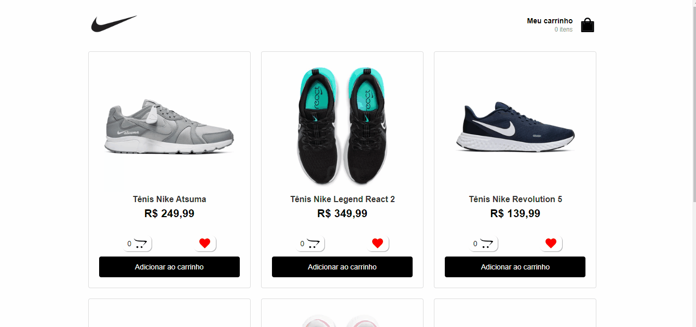

<h1 align="center">
     
    <span>Fake</span>
</h1>
<p align="center">Uma aplicação react com react-redux utilizando hooks que simula um site da nike fake</p>

<h1 align="center">
    <a href="https://pt-br.reactjs.org/">🔗 React</a>
    <a href="https://react-redux.js.org/api/hooks">🔗 React Redux</a>
</h1>

<div align="center">
    
</div>

### 🎲 Rodando em sua máquina

```bash
# Clone o repositório do backend
$ git clone <https://github.com/JonathanAllisson/nike-fake-shopping>

# Acesse a pasta do projeto no terminal/cmd
# Vá para a pasta do projeto
# Instale as dependências
$ npm install ou yarn

# Execute a aplicação em modo de desenvolvimento
$ npm run dev ou yarn dev

# O servidor inciará na porta:3000 - acesse <http://localhost:3000>

```

### 🛠 Tecnologias

As seguintes ferramentas foram usadas na construção do projeto:

- [React](https://pt-br.reactjs.org/)
- [Redux](https://react-redux.js.org/api/hooks)
- [Styled-Components](https://styled-components.com/)
- [json-server](https://github.com/typicode/json-server)
